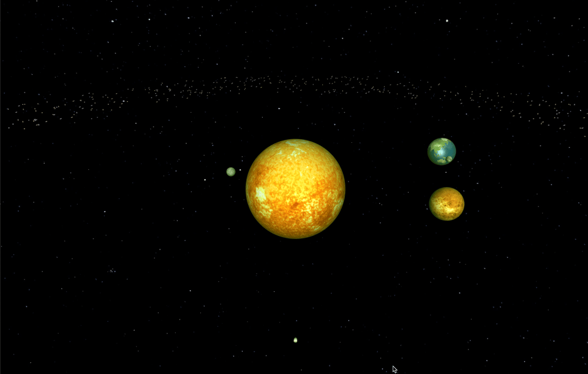
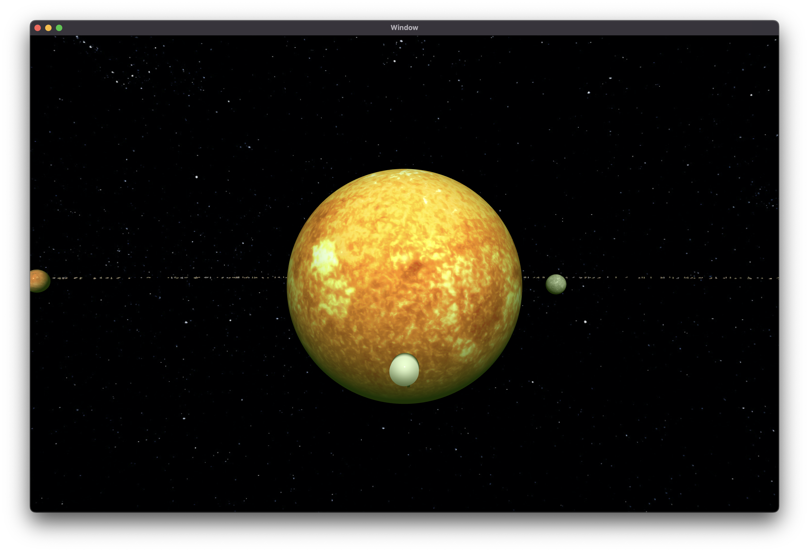
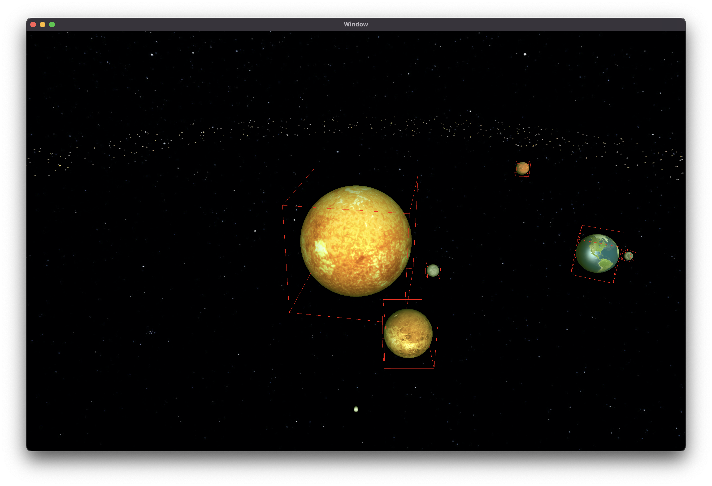

# solarsystem-metal
Solar System demonstration using Apple MetalKit

## Summary

It's still in development but you can try a few features that I've developed so far.
When you run macOS build, you can;
- Change cameras (pressing 1-4)
- Bounding Box on/off (pressing 5 first for anti aliasing off, then pressing 0)
- Zoom in/out with scrolling and pan your camera with mouse/trackpad (only on camera 1)
- Control the demo rocket using "a,d" for rotate an "space" for acceleration (only on camera 4)

## Screens

